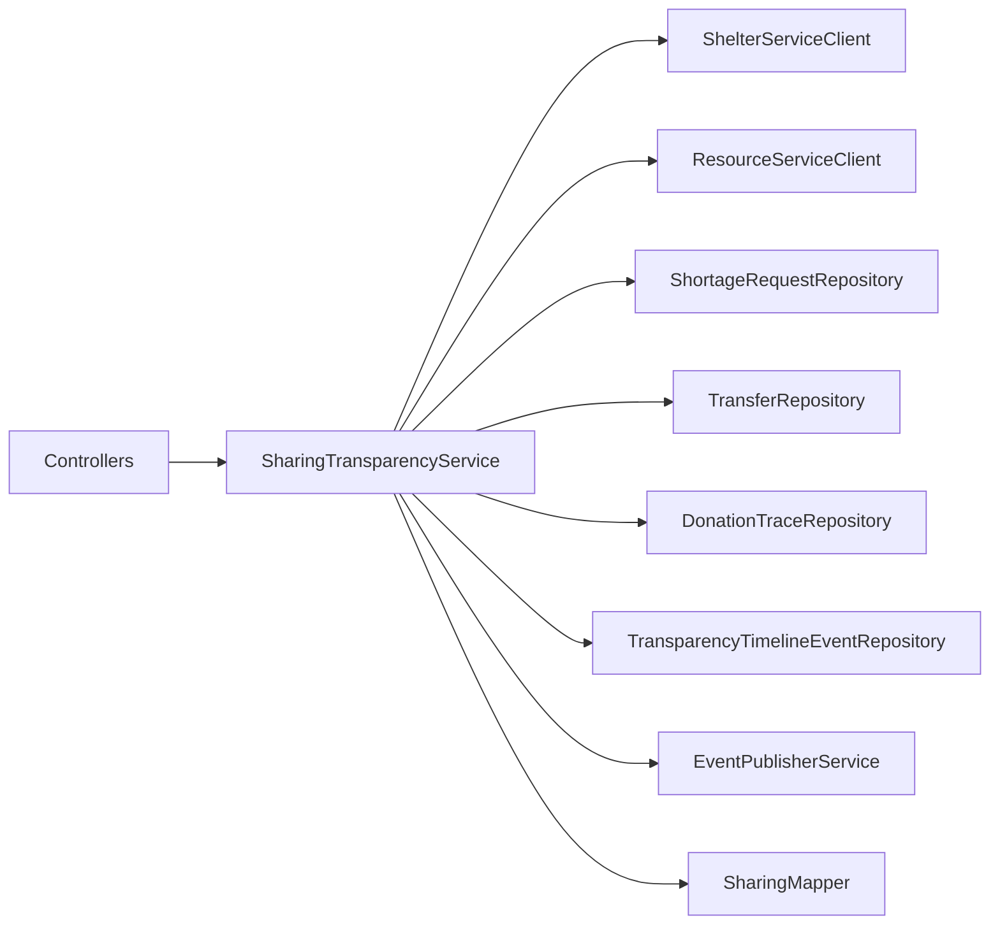

# Sharing & Transparency Service Components

```mermaid
flowchart LR
    Controller["Controllers"] --> Service["SharingTransparencyService"]
    Service --> ShelterClient["ShelterServiceClient"]
    Service --> ResourceClient["ResourceServiceClient"]
    Service --> ShortageRepo["ShortageRequestRepository"]
    Service --> TransferRepo["TransferRepository"]
    Service --> TraceRepo["DonationTraceRepository"]
    Service --> TimelineRepo["TransparencyTimelineEventRepository"]
    Service --> Publisher["EventPublisherService"]
    Service --> Mapper["SharingMapper"]
```
