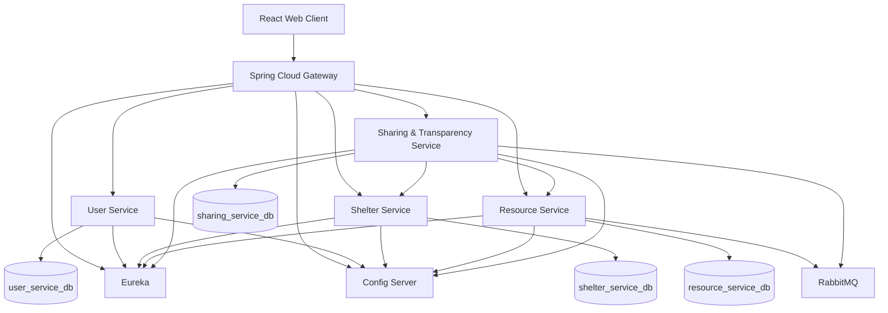

# Container Diagram

```mermaid
flowchart TD
    UI["React Web Client"] --> Gateway["Spring Cloud Gateway"]
    Gateway --> Auth["User Service"]
    Gateway --> Shelters["Shelter Service"]
    Gateway --> Inventory["Resource Service"]
    Gateway --> Workflow["Sharing & Transparency Service"]

    Workflow --> Inventory
    Workflow --> Shelters

    Auth --> UDB[("user_service_db")]
    Shelters --> SDB[("shelter_service_db")]
    Inventory --> RDB[("resource_service_db")]
    Workflow --> TDB[("sharing_service_db")]

    Inventory --> MQ["RabbitMQ"]
    Workflow --> MQ

    Gateway --> Registry["Eureka"]
    Auth --> Registry
    Shelters --> Registry
    Inventory --> Registry
    Workflow --> Registry

    Gateway --> Config["Config Server"]
    Auth --> Config
    Shelters --> Config
    Inventory --> Config
    Workflow --> Config
```
