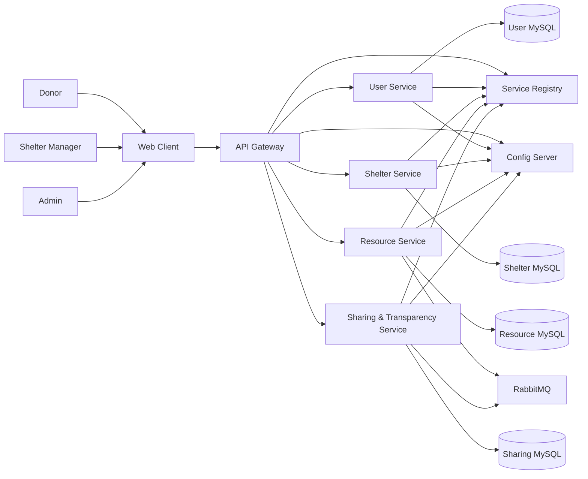
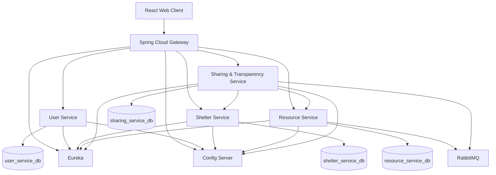
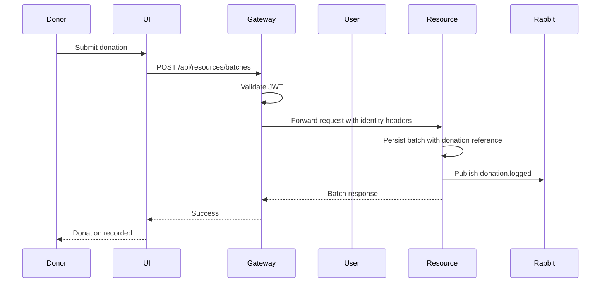
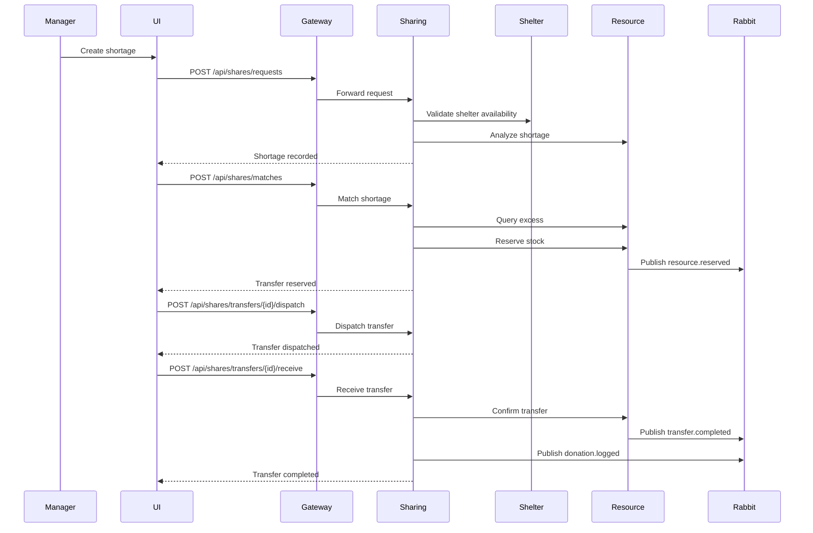

# Architecture Diagrams

## System Context

```mermaid
flowchart LR
    Donor["Donor"] --> UI["Web Client"]
    Manager["Shelter Manager"] --> UI
    Admin["Admin"] --> UI
    UI --> Gateway["API Gateway"]
    Gateway --> User["User Service"]
    Gateway --> Shelter["Shelter Service"]
    Gateway --> Resource["Resource Service"]
    Gateway --> Sharing["Sharing & Transparency Service"]
    User --> UserDB[("User MySQL")]
    Shelter --> ShelterDB[("Shelter MySQL")]
    Resource --> ResourceDB[("Resource MySQL")]
    Sharing --> SharingDB[("Sharing MySQL")]
    Resource --> Rabbit["RabbitMQ"]
    Sharing --> Rabbit
    Gateway --> Registry["Service Registry"]
    User --> Registry
    Shelter --> Registry
    Resource --> Registry
    Sharing --> Registry
    Gateway --> Config["Config Server"]
    User --> Config
    Shelter --> Config
    Resource --> Config
    Sharing --> Config
```

## Container View

```mermaid
flowchart TD
    UI["React Web Client"] --> Gateway["Spring Cloud Gateway"]
    Gateway --> Auth["User Service"]
    Gateway --> Shelters["Shelter Service"]
    Gateway --> Inventory["Resource Service"]
    Gateway --> Workflow["Sharing & Transparency Service"]

    Workflow --> Inventory
    Workflow --> Shelters

    Auth --> UDB[("user_service_db")]
    Shelters --> SDB[("shelter_service_db")]
    Inventory --> RDB[("resource_service_db")]
    Workflow --> TDB[("sharing_service_db")]

    Inventory --> MQ["RabbitMQ"]
    Workflow --> MQ

    Gateway --> Registry["Eureka"]
    Auth --> Registry
    Shelters --> Registry
    Inventory --> Registry
    Workflow --> Registry

    Gateway --> Config["Config Server"]
    Auth --> Config
    Shelters --> Config
    Inventory --> Config
    Workflow --> Config
```

## Donation Intake Sequence

```mermaid
sequenceDiagram
    participant Donor
    participant UI
    participant Gateway
    participant User
    participant Resource
    participant Rabbit

    Donor->>UI: Submit donation
    UI->>Gateway: POST /api/resources/batches
    Gateway->>Gateway: Validate JWT
    Gateway->>Resource: Forward request with identity headers
    Resource->>Resource: Persist batch with donation reference
    Resource->>Rabbit: Publish donation.logged
    Resource-->>Gateway: Batch response
    Gateway-->>UI: Success
    UI-->>Donor: Donation recorded
```

## Shortage and Transfer Sequence

```mermaid
sequenceDiagram
    participant Manager
    participant UI
    participant Gateway
    participant Sharing
    participant Shelter
    participant Resource
    participant Rabbit

    Manager->>UI: Create shortage
    UI->>Gateway: POST /api/shares/requests
    Gateway->>Sharing: Forward request
    Sharing->>Shelter: Validate shelter availability
    Sharing->>Resource: Analyze shortage
    Sharing-->>UI: Shortage recorded

    UI->>Gateway: POST /api/shares/matches
    Gateway->>Sharing: Match shortage
    Sharing->>Resource: Query excess
    Sharing->>Resource: Reserve stock
    Resource->>Rabbit: Publish resource.reserved
    Sharing-->>UI: Transfer reserved

    UI->>Gateway: POST /api/shares/transfers/{id}/dispatch
    Gateway->>Sharing: Dispatch transfer
    Sharing-->>UI: Transfer dispatched

    UI->>Gateway: POST /api/shares/transfers/{id}/receive
    Gateway->>Sharing: Receive transfer
    Sharing->>Resource: Confirm transfer
    Resource->>Rabbit: Publish transfer.completed
    Sharing->>Rabbit: Publish donation.logged
    Sharing-->>UI: Transfer completed
```
