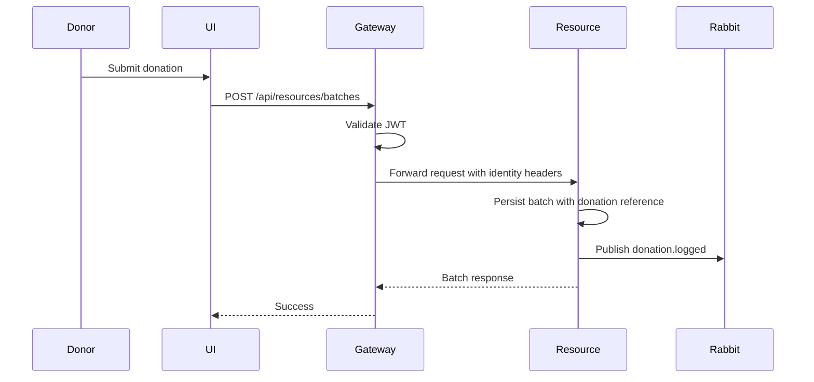

# Donation Intake Sequence

```mermaid
sequenceDiagram
    participant Donor
    participant UI
    participant Gateway
    participant Resource
    participant Rabbit

    Donor->>UI: Submit donation
    UI->>Gateway: POST /api/resources/batches
    Gateway->>Gateway: Validate JWT
    Gateway->>Resource: Forward request with identity headers
    Resource->>Resource: Persist batch with donation reference
    Resource->>Rabbit: Publish donation.logged
    Resource-->>Gateway: Batch response
    Gateway-->>UI: Success
```
