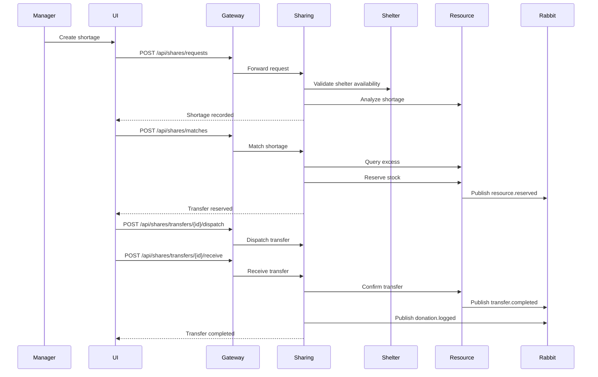

# Shortage Matching and Transfer Sequence

```mermaid
sequenceDiagram
    participant Manager
    participant UI
    participant Gateway
    participant Sharing
    participant Shelter
    participant Resource
    participant Rabbit

    Manager->>UI: Create shortage
    UI->>Gateway: POST /api/shares/requests
    Gateway->>Sharing: Forward request
    Sharing->>Shelter: Validate shelter availability
    Sharing->>Resource: Analyze shortage
    Sharing-->>UI: Shortage recorded

    UI->>Gateway: POST /api/shares/matches
    Gateway->>Sharing: Match shortage
    Sharing->>Resource: Query excess
    Sharing->>Resource: Reserve stock
    Resource->>Rabbit: Publish resource.reserved
    Sharing-->>UI: Transfer reserved

    UI->>Gateway: POST /api/shares/transfers/{id}/dispatch
    Gateway->>Sharing: Dispatch transfer

    UI->>Gateway: POST /api/shares/transfers/{id}/receive
    Gateway->>Sharing: Receive transfer
    Sharing->>Resource: Confirm transfer
    Resource->>Rabbit: Publish transfer.completed
    Sharing->>Rabbit: Publish donation.logged
    Sharing-->>UI: Transfer completed
```
