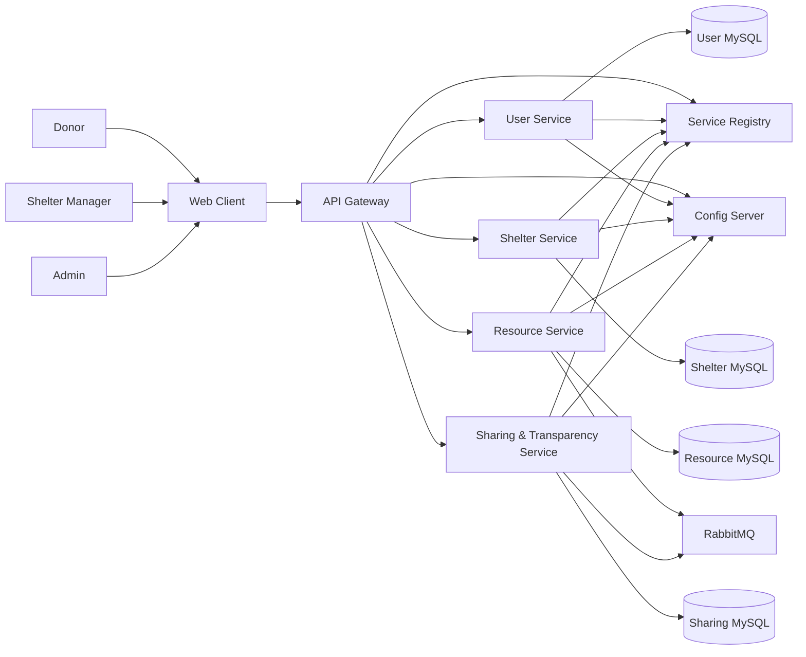

# System Context Diagram

```mermaid
flowchart LR
    Donor["Donor"] --> UI["Web Client"]
    Manager["Shelter Manager"] --> UI
    Admin["Admin"] --> UI
    UI --> Gateway["API Gateway"]
    Gateway --> User["User Service"]
    Gateway --> Shelter["Shelter Service"]
    Gateway --> Resource["Resource Service"]
    Gateway --> Sharing["Sharing & Transparency Service"]
    User --> UserDB[("User MySQL")]
    Shelter --> ShelterDB[("Shelter MySQL")]
    Resource --> ResourceDB[("Resource MySQL")]
    Sharing --> SharingDB[("Sharing MySQL")]
    Resource --> Rabbit["RabbitMQ"]
    Sharing --> Rabbit
    Gateway --> Registry["Service Registry"]
    User --> Registry
    Shelter --> Registry
    Resource --> Registry
    Sharing --> Registry
    Gateway --> Config["Config Server"]
    User --> Config
    Shelter --> Config
    Resource --> Config
    Sharing --> Config
```
